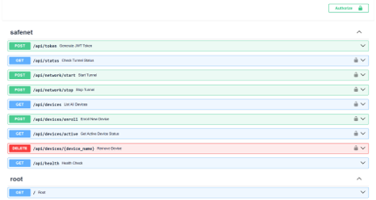
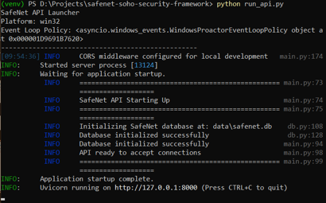

# API Reference

The SafeNet Control Plane is managed entirely via a FastAPI REST interface. All significant operations require JWT-based authentication.



## Authentication Flow
SafeNet uses OAuth2 with Password (and hashing), utilizing JWT (JSON Web Tokens) for session validation.

1. **Endpoint:** `POST /token`
2. **Payload:** `multipart/form-data` with `username` and `password`.
3. **Response:** Returns an `access_token` and `token_type` (bearer).

All subsequent secured endpoints require the header:
`Authorization: Bearer <token>`

## Peer Lifecycle API

### 1. Enroll a New Peer
Provisions a new cryptographic identity and allocates a `/32` IP address.

**Endpoint:** `POST /peers/enroll`
**Required Header:** `Authorization: Bearer <token>`

**JSON Request Payload:**
```json
{
  "name": "Jane_Laptop",
  "device_type": "windows",
  "owner": "Jane Doe"
}
```

**JSON Response Payload:**
```json
{
  "status": "success",
  "peer_id": 5,
  "allocated_ip": "10.8.0.7/32",
  "public_key": "xxyyzz...",
  "config_string": "[Interface]\nPrivateKey=...\nAddress=10.8.0.7/32\n..."
}
```
*(The `config_string` can be rendered into a QR code or `.conf` file for the client).*

### 2. List Active Peers
Retrieves all registered peers from the database.

**Endpoint:** `GET /peers`
**Required Header:** `Authorization: Bearer <token>`

**Response:**
Returns an array of JSON peer objects including their last-handshake time (if available) and total bytes transferred.

### 3. Revoke/Remove Peer
Instantly removes a peer from the SQLite database and issues a `syncconf` command to WireGuard, mathematically severing their connection immediately.

**Endpoint:** `DELETE /peers/{peer_id}`
**Required Header:** `Authorization: Bearer <token>`

## Security Monitoring



The API also exposes standard `/health` endpoints for external monitoring solutions to pull framework telemetry.
